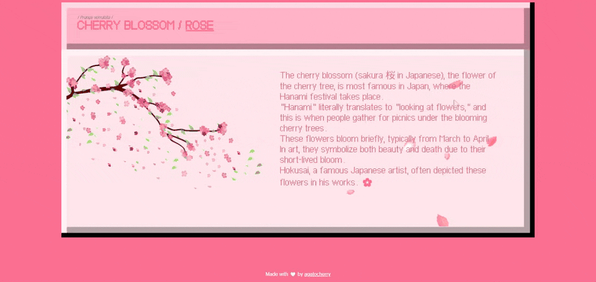

# 90s-Floral-Website 🌸/🌹  
My project for the Codédex Hackathon (December 2024): a cute and nostalgic 90s-style floral website featuring an herbarium with cherry blossoms and other flowers. This is also my first website! 🌸✨  

#CodedexHackathon

## About the project 💻  

This website is designed for **1080x1920** screen resolution. You can view the live site [here](https://90s-floral-website.vercel.app/).  
I used Vercel to host the website and also integrated its analytics features.  

## Acknowledgements 🙏  
- The cherry blossom GIF used in this project was sourced from [DeviantArt](https://www.deviantart.com/ayshamostafiz/art/Cherry-Blossom-GIF-587203731) (@ayshamostafiz).  
- The pink pixel cursor is from [Custom Cursor](https://custom-cursor.com/fr/collection/color-pixels/baby-pink-pixel).  
